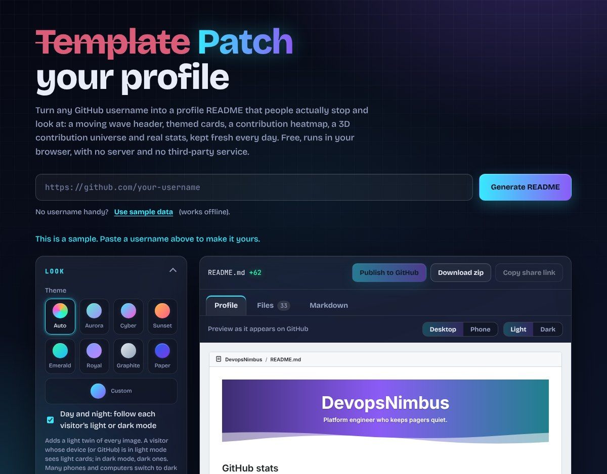
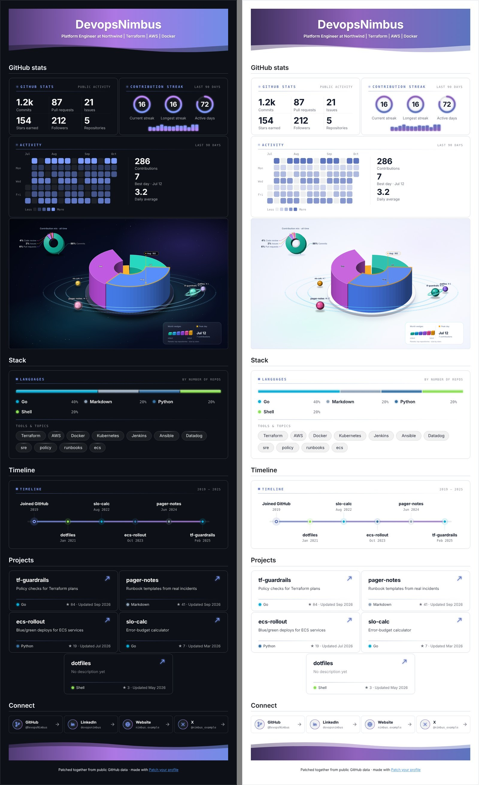
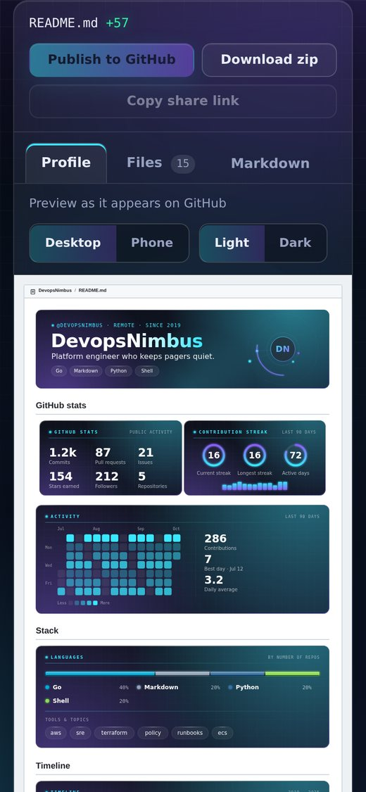

# readme-diff

Turn any GitHub username into a profile README that stands out: a themed banner, stats, a contribution heatmap, a language card, a timeline, project cards and link buttons, all as plain SVG files in your own profile repo. Pick a theme, check the result in a GitHub-style preview, then publish it in one click or download a zip.

- **No workflows required for the core app.** An optional daily-update workflow can be generated for your own profile repo.
- **No third-party services.** No badge or stats APIs. Data comes straight from `api.github.com`, and every card is drawn in your browser.
- **Three ways to use it.** A static web page, a command-line tool, and share links. All share one engine (`js/core.js`).

## Preview



A profile README made with it, in a dark theme and in the light Paper theme:





## Project layout

```
index.html        The page
css/style.css     Glass / neon theme for the page
js/core.js        Engine: parse input, build the model, write the README and banner (no network, no DOM)
js/cards.js       Draws the stats, streak, heatmap, languages, timeline, project and connect cards as SVG files
js/universe.js    Draws the optional 3D contribution universe (ported from Git3D Universe)
js/github.js      Fetches profile, repos and activity from the GitHub API
js/preview.js     Shows the README as a GitHub profile page would (safe, whitelist-based renderer)
js/publish.js     Commits the README, banner and cards to <user>/<user> in one commit
js/automation.js  Writes the daily-update workflow, config and a copy of the generator for your profile repo
js/zip.js         Tiny ZIP writer so every generated file downloads together
js/app.js         Wires the page to the engine
cli.js            Command-line version (Node 18+)
test/*.test.js    Tests (node:test, no dependencies)
tools/            Optional developer tools, both need Playwright: layout-fuzz.js (measures card text in a real browser) and day-night-check.js (plays a full day of sunrise and sunset on a visitor's device)
docs/             Example screenshots
```

## Run the web app

It's static files, so any static server works:

```bash
npm run serve        # or: python3 -m http.server 8080
# open http://localhost:8080
```

The **Download zip** button gives you everything: `README.md`, `banner.svg` and a `cards/` folder. Upload all of it to your `username/username` repo, otherwise the images show as broken.

Opening `index.html` directly from disk also works in most browsers. "Use sample data" works without a network.

### Host it on GitHub Pages

1. Push this folder to a GitHub repository.
2. Enable **Settings → Pages → Build and deployment → Source: GitHub Actions**.
3. The repository workflow deploys the static root directly.
4. The site is live at `https://<user>.github.io/<repo>/`.

For this repository, the deployed site is **https://sandeepkomal.github.io/README-Glassfolio/**. See [docs/GITHUB_PAGES.md](docs/GITHUB_PAGES.md) for deployment and troubleshooting.

## Hosted site

README-Glassfolio is deployed as a static GitHub Pages site:

**https://sandeepkomal.github.io/README-Glassfolio/**

Deployment is handled by the repository workflow at `.github/workflows/pages.yml`. The application itself does not require a backend or build service.

## Documentation

- [Documentation hub](docs/README.md)
- [GitHub Pages deployment guide](docs/GITHUB_PAGES.md)
- [Security policy](SECURITY.md)

## Security and license

The project is released under the **MIT License**. See [LICENSE](LICENSE).

The browser application uses a restrictive Content-Security-Policy, keeps publishing tokens in memory, and includes security-focused tests. See [SECURITY.md](SECURITY.md).

## Use the CLI

```bash
node cli.js https://github.com/DevopsNimbus
node cli.js DevopsNimbus --style changelog --role "Cloud Engineer" --stack "AWS, Terraform"
node cli.js --sample            # no network
GITHUB_TOKEN=ghp_xxx node cli.js DevopsNimbus   # exact full-year streaks
```

Files are written to `./out/`: `README.md`, `banner.svg` and `cards/`. Run `node cli.js --help` for every option. Set `GITHUB_TOKEN` to raise the API rate limit.

## Two ways to use the result

Every card is an SVG image file that sits next to `README.md` in your profile repo (`<user>/<user>`). GitHub shows images stored in a repo, but not images embedded inside a README, so the README and its image files always travel together. Nothing runs on a server and no third-party service is involved.

| | What you do | Needs |
| --- | --- | --- |
| **Publish** (easiest) | Click *Publish to GitHub*, paste a token. One commit lands in `<user>/<user>`. | A fine-grained token |
| **Download zip** | Download the zip and upload everything to `<user>/<user>`. | Nothing |

### Publish: commit straight to your profile

1. Create the repo `<user>/<user>` on GitHub if you don't have it (public, and the name must match your username).
2. Create a [fine-grained token](https://github.com/settings/personal-access-tokens/new) as shown in [Token setup](#token-setup) below.
3. In the website, click **Publish to GitHub**, paste the token and press **Publish**. All files go in as one commit. The token is sent only to api.github.com and is never stored.

#### Token setup

One fine-grained token covers everything: reading your data, publishing, and adding [daily updates](#keep-the-stats-fresh-every-day). Create it at [github.com/settings/personal-access-tokens/new](https://github.com/settings/personal-access-tokens/new):

**Repository access:** choose *Only select repositories* and pick your profile repository, for example `your-username/your-username`.

**Repository permissions:**

| Permission | Setting | Why |
| --- | --- | --- |
| Contents | **Read and write** | Commit the README, banner and cards |
| Workflows | **Read and write** | Add the daily-update workflow in `.github/workflows/` (only needed for *Daily updates*) |
| Metadata | Read-only | Set automatically by GitHub |

Nothing else is needed: no Administration, Issues, Pull requests, Actions, Pages or Secrets. GitHub requires *Contents* **and** *Workflows* write access for any change under `.github/workflows/`.

With a classic token instead, tick `public_repo`, plus `workflow` for daily updates.

Paste the token into the **Publish** box itself. If that box is left empty, Publish uses the token from *Exact data*, which is often created with no permissions at all. If the token can write files but not workflows, the README and cards are still published, and the page says that daily updates were not added and what to change on that token. You can edit an existing token's permissions; you don't need a new one.

It refuses to publish to anyone else's profile, handles a brand-new empty repo, and gives a plain message when the repo is missing or the token lacks permission.

From the terminal: `GITHUB_TOKEN=github_pat_xxx node cli.js <user> --publish --theme cyber`.

### Keep the stats fresh every day

A published README is a **snapshot**: the numbers are as of the moment you published. GitHub profile READMEs are static files, so something has to run on a schedule to refresh them, and with no server of ours the only place that can be is a small GitHub Action in **your own profile repo**. Tick *Daily updates* (or use `--daily`) and publishing adds two things:

- `.github/workflows/update-readme.yml`: runs once a day, at a time derived from your username so profiles don't all run at once (shown in the page, for example 22:26 UTC), and whenever you press *Run workflow* in the Actions tab.
- `.readme-patch/`: your saved choices (`config.json`) and a copy of this generator, so your repo is self-contained and you can read every line that runs.

Each run reads your public GitHub data, rebuilds `README.md` and the images, and commits **only if something changed** (as `github-actions[bot]`).

What to know before you switch it on:

- **No third-party code.** The workflow has no `uses:` line at all: only plain shell steps that run the copy in `.readme-patch/`. Its only permission is `contents: write`, it uses no secrets, and it only talks to `api.github.com`.
- **It rewrites `README.md` and the images every day**, so edits you make to those by hand will be replaced. Change `.readme-patch/config.json` (or publish again from the page) instead. The files it manages are `README.md`, `banner.svg`, `banner-light.svg` and every `.svg` in `cards/`; nothing else in the repo is touched.
- **It never publishes worse data.** If GitHub's activity can't be read on a given day (an outage, a rate limit), the run stops and changes nothing, so you keep yesterday's good profile instead of a half-empty one.
- **Your token needs one more permission** to add the workflow file: *Workflows: Read and write* for a fine-grained token, or the `workflow` scope for a classic one (see [Token setup](#token-setup)). Without it, your README and cards are still published, but daily updates are left out and the page tells you exactly what to add.
- **It's free** for public repositories. A run takes well under a minute.
- **GitHub pauses scheduled workflows** in a public repo after 60 days without activity. Re-enable it in the Actions tab if that happens.
- **To stop it**, delete the workflow file or disable it in the Actions tab. Your README and images stay as they are.
- The commits come from `github-actions[bot]`, so they don't count towards your contribution graph.

`config.json` contains your choices (theme, job title, skills, LinkedIn name), so it's visible in your public repo.

### Download zip

Unzip and upload everything (`README.md`, `banner.svg` and the `cards/` folder) to `<user>/<user>`, for example by dragging them into the repo page on github.com. If an image is missing, it shows as a broken picture.

## Look and options

**Themes.** Pick `auto` (colours chosen from the username, so every profile differs), or one of seven fixed themes: `aurora`, `cyber`, `sunset`, `emerald`, `royal`, `graphite` and the light `paper`. Every banner and card follows the theme. Text contrast is checked in the tests for all of them.

**Your own colours.** Choose *Custom* and pick any two accent colours. Backgrounds are built from near-black tinted by your colours, accents are lightened automatically if they'd be hard to read, and the light version of an adaptive README darkens them just enough. The tests throw 300 random and extreme colour pairs at it (pure black, pure white, neon, grey) and check that body text, headings and accents stay readable in dark and light. From the terminal: `--colors "#ff8800,#00c2a8"`.

**Motion.** Aurora light drifts, rings and the timeline draw in, heatmap columns fade up, and the banner's orbit turns slowly. It's plain CSS inside each SVG, with no scripts. Every animation only describes its *starting* state, so the still image is always the finished design, and anyone with "reduce motion" on sees exactly that still image. Switch it off with the *Subtle motion* checkbox or `--no-animation`. The files stay small (the largest, a full-year heatmap, is about 45 KB).

**Contribution heatmap.** Day-by-day cells laid out by weekday like GitHub's own graph, with month and weekday labels, a level legend and headline numbers (total, best day, daily average). With a token it covers the past year; without one it shows the last 90 days of public activity.

**Layouts.**

| Layout | Projects |
| --- | --- |
| `showcase` (default) | Clickable project cards |
| `changelog` | A release-notes card: a rail of glowing year markers, with an ADDED row (language, name, description, stars) for each repo, newest year first |

The job title you enter is shown right after your name, as "Role at Company" (the company comes from your GitHub profile). If you leave it blank, your GitHub bio is used. An optional tagline appears as a smaller line beneath it.

Both layouts can include a banner, stats, streak and heatmap cards, a Languages card (proportion bar, legend and tool pills), a timeline card, project cards and a row of clickable Connect buttons. With cards switched off, you get a text-only README with no image files. A language donut chart is available as an opt-in extra: with cards on it's drawn inside the Languages card (total repos in the middle, a legend with share bars beside it); in text mode it's a Mermaid pie.

**Day and night (light and dark).** *Day and night: follow each visitor's light or dark mode* is **on by default** (turn it off with `--no-adaptive`, or untick it on the page). It writes two complete image sets: your chosen theme for dark-mode visitors and a light twin (`-light.svg`) for everyone else, wrapped in `<picture>` with `prefers-color-scheme`, the mechanism GitHub documents for profile READMEs. So your profile is light for visitors whose device (or GitHub) is in light mode and dark for those in dark mode. Many phones and computers switch to dark at sunset on their own, so in practice it follows each visitor's day and night, and an open page swaps live when their device flips. **A README can't read a clock** (GitHub strips scripts, and CSS has no time of day), so it follows the visitor's own setting, not a time you pick; someone who keeps their device in one mode always sees that one. This was checked in a real browser by simulating a full day on the visitor's device: all images swap together at sunrise and sunset, with nothing mixed or missing. Because each set is only ever shown on its matching GitHub page, both sets are **flat, in exactly the page colour** (`#ffffff` in light, `#0d1117` in dark) and framed only by GitHub's own hairline border (`#d1d9e0` / `#3d444d`), so the cards look like GitHub's own boxes instead of floating on the page; the theme lives on in the accents, rings, heatmap and motion. Light twins keep each theme's identity with accents darkened until they reach a readable 4:1 contrast. If your theme is already light (Paper), the dark partner is Royal. It roughly doubles the number of files.

**Share links.** *Copy share link* produces a URL like `?user=DevopsNimbus&theme=cyber&role=Cloud+Engineer`. Opening it rebuilds the same setup and generates straight away. Only values that differ from the defaults are included, and anything invalid in a link is ignored.

**Section order.** The *Order & projects* group has ↑/↓ buttons to put GitHub stats, Stack, Timeline, Projects and Connect in any order (keyboard friendly, with the focus following the moved item). The banner stays first and the footer last, and sections you've switched off stay off. From the terminal: `--order projects,stats,connect`.

**Featured projects.** Instead of "most stars wins", tick the repos you want, up to six, and they appear in the order you ticked them (numbered badges show it). Pick none to go back to your most-starred. Names that don't exist on the loaded profile are dropped, so a saved pick can't show a stranger's repo. From the terminal: `--featured api,web,docs`.

**Downloads.** The *Files* tab has SVG and PNG buttons on every image, and *Download all as PNG (zip)*. PNGs are 2× size and are always the finished design (an animated SVG would otherwise be caught at its first, faded-out frame). Use PNG where a site won't take SVG, such as LinkedIn, X or Slack.

**Share image.** Under the files there's a 1280×640 picture with your name, title, skills and four headline numbers, ready for LinkedIn, X or a repository's social preview. It always uses your theme, light/dark choice and custom colours, is never animated, and is deliberately kept out of the README package, the zip and the publish commit. From the terminal: `--share-image`.

**3D contribution universe.** Tick *3D contribution universe* (or use `--universe`) to add a full-width card under the heatmap: your contribution calendar as a 3D terrain on a plate, your top repos orbiting it as planets sized by stars and coloured by language, and a panel with totals, streaks and a weekly sparkline. It's ported from Git3D Universe (`SandeepKomal/Git3D-Universe` on GitHub, MIT licence, Copyright (c) 2026 Sandeep Komal Pothu) and reworked to fit this project:

- **No extra token, no extra workflow.** It's drawn from the same data as the other cards, so a fine-grained token isn't required, nothing new is added to `.github/workflows/`, and [daily updates](#keep-the-stats-fresh-every-day) refresh it together with everything else. If you used the standalone Git3D Universe Action before, you can delete its workflow from your profile repo.
- **Follows your template.** Its colours come from the theme you pick (including Custom colours), and with *Day and night* it gets a light twin on GitHub's white page and a dark one with a starfield on GitHub's dark page, exactly like the other cards.
- **Respects reduced motion.** The planets orbit with CSS, so visitors who prefer reduced motion see them standing still, and *Subtle motion* off gives a still picture.
- With a token it covers the past year; without one it shows the last 90 days with bigger cells.

**Recently pushed.** Tick *Recently pushed* (or use `--recent`) to add a card with your five latest pushes, each with its language and date, and a pulsing marker on the newest. It's off by default, works in every layout, and moves with the other sections. With cards switched off it becomes a plain list.

**Text that always fits.** Repo names and descriptions can be any length, in any font the viewer has, so the cards don't guess at text widths. Where two pieces of text share a row, they're laid out as one flowing text so the second always starts after the first, and anything too long fades out at the edge of its column instead of colliding. `tools/layout-fuzz.js` proves it: it renders about 1,800 cards of extreme names (wide letters, narrow letters, 90-character names, million-star counts) in a real browser and measures every text box.

**Footer credit.** The README footer ends with "made with Patch your profile", linked back to the page that generated it. Untick *Footer credit link* (or use `--no-credit`) to remove it.

## Using the page

- **Profile tab.** The preview shows your README as GitHub will show it, inside a mock profile page with a *Light / Dark* switch and a *Desktop / Phone* switch. The frame is drawn at GitHub's real widths (896px, or a 390px phone) and scaled as a whole to fit the panel, so the proportions you see are the proportions visitors see. It uses a small renderer written for this tool (`js/preview.js`) that only understands what the tool writes. It builds elements from a whitelist and never inserts raw HTML, so markup inside a bio or repo description can't do anything. *Files* lists every image, and *Markdown* shows the README as a diff.
- **Make it even better.** Once a real profile is loaded, a short checklist with a score points out what's missing (job title, skills, LinkedIn, repo descriptions, a token for the full-year heatmap, a website). Clicking a tip jumps to the control that fixes it, and the tip disappears once it's done.
- **Remembers your choices.** Theme, text fields and switches are saved in this browser's local storage so they're still there next time. The token and your username are never saved. *Reset all options* clears it. A share link always wins over saved choices.
- **Clear errors.** While GitHub is being read you see a loading skeleton. If you hit the rate limit, the message offers *Add a token*, and if you're offline it offers *Use sample data*. Neither leaves you with a blank preview.
- **Keyboard and phones.** Tabs follow the standard pattern (arrow keys, Home and End), controls have visible focus rings, and the layout is checked at phone width: no sideways scrolling and no card poking off the screen.

## Security

The page is built to be safe to paste a token into, and the browser enforces it rather than just the code being careful:

- **A strict Content-Security-Policy** (a `<meta>` tag at the top of `index.html`): scripts only from this site, network requests only to this site and `https://api.github.com`, no frames or plugins, no form posts, no inline scripts or styles, no `eval`. An injected script can't run, and nothing can be sent to another server.
- **The daily job is yours, and small.** It's a workflow file and a copy of the generator in your own repo, with no third-party actions, no secrets and one permission. The page reads those generator files from its own site (the policy allows `'self'` for that and nothing else but `api.github.com`).
- **No HTML injection.** The page never uses `innerHTML` or inserts untrusted markup. The Profile preview builds elements from a whitelist and only shows images the tool generated.
- **Tokens stay in memory.** A token is sent to `api.github.com` and nowhere else, cleared after publishing, and is not an option at all, so it can't be saved or put in a share link. The page sends no referrer.
- **Proved, not assumed.** The browser tests run every flow (generate, downloads, publish) with zero policy violations, then attack the page: an injected script, an inline event handler, `eval`, and attempts to reach another host by `fetch`, XHR, image, stylesheet, iframe, form post and WebSocket. All are blocked and nothing reaches the attacker's address. `test/page.test.js` fails if anyone adds an inline script, `innerHTML`, `eval`, a new host or a stored token, and was itself checked by deliberately introducing each of those mistakes.

What a policy can't do: it doesn't stop a page from navigating away (for example `window.location = ...`), which is one more reason the page avoids inserting untrusted markup in the first place. Run your own copy, and use a fine-grained token limited to your profile repo.

## Test

```bash
npm test
```

Optional, needs Playwright (the project itself has no dependencies):

```bash
npm install --no-save playwright && npx playwright install chromium
node tools/layout-fuzz.js          # renders ~1,800 extreme cards and measures every text box
node tools/day-night-check.js      # simulates a visitor's device going light at sunrise and dark at sunset
```

## Stats and streaks

The stats card (commits, pull requests, issues, stars, followers) and the streak card (current streak, longest streak, active days, weekly chart) use two data sources:

| | Without a token | With a token |
| --- | --- | --- |
| Commits, PRs, issues | Search API totals (public, all time) | GraphQL, past year |
| Streaks and active days | Public events feed, up to the last 90 days | Full contribution calendar, past year |
| Requests per profile | about 8 (60 per hour limit) | 3 |

Without a token the streak is a lower bound, because GitHub only exposes about 90 days of public events. A token needs no scopes for public data and is never stored. Cards are generated locally as SVG, so there's no third-party image service. They share one visual language: deep-space glass panels with aurora light, a faint tech grid and neon accents. Each profile gets one of six curated neon color pairs, chosen from the username.

## Limits

- Only public data is used. Without a token, the heatmap and streaks come from GitHub's public events feed, which covers about the last 90 days; a token gives the full-year calendar.
- **Phones.** GitHub shows a README about 360px wide. Paired cards (stats and streak, project cards, Connect buttons) use fixed pixel widths, so on a phone they stack at close to full size (a 14px label stays near 11px). The wide cards (heatmap, languages, timeline, changelog, recently pushed, banner) are drawn for a desktop column and shrink to roughly 40% on a phone, so their small text gets hard to read. The *Phone* preview shows exactly this. A narrower "compact" design for those cards would fix it and is the natural next step.
- Motion is verified in Chromium. GitHub shows SVGs through its own image proxy, which allows inline CSS but not scripts, so the animations should play there too, but check your own profile once. If a viewer blocks them, the still image shows.
- **The daily update has been tested here but not on GitHub itself.** The workflow's real shell steps ran against real git repositories and a fake GitHub API (first run, quiet day, busy day, outages, settings changes, files that aren't ours), but I couldn't run an actual scheduled GitHub Action. Whether GitHub's temporary `GITHUB_TOKEN` is accepted for the contribution calendar isn't confirmed; if it isn't, the update falls back to the public activity feed, which covers about 90 days. Press *Run workflow* once after publishing and check the run in the Actions tab.
- Anonymous GitHub API access allows 60 requests an hour per network. Each profile uses about 8. A token (optional field in the page, or `GITHUB_TOKEN` for the CLI) raises that. The page never stores the token.
- Language stats count repos per primary language, not lines of code.

## Extend it

Add a section by writing a function in `js/core.js` that returns an array of markdown lines, then call it inside `buildReadme`. Add a layout by adding a case for `o.style` there and an `<option>` in `index.html`.

## License

MIT
