# How to use Patch your profile

Turn your GitHub profile into a live, self-updating README in about ten minutes: a moving wave header, stats and streak cards, a contribution heatmap, a 3D contribution universe, your projects and Connect buttons, in light and dark versions that follow each visitor's GitHub theme.

**Website:** [readme-glassfolio.in](https://readme-glassfolio.in/)

You need:

- a GitHub account,
- a public repository named exactly like your username (step 1),
- a fine-grained token that can write to that one repository (steps 2 to 8).

Everything runs in your browser. The token is sent only to GitHub and is never stored.

---

## Part 1: Create your profile repository

### Step 1. Create `your-username/your-username`

On GitHub, click **+ → New repository**. Name it exactly like your username. GitHub confirms it's the *special* repository that shows on your profile. Set it to **Public** and switch **Add README** on, then click **Create repository**.

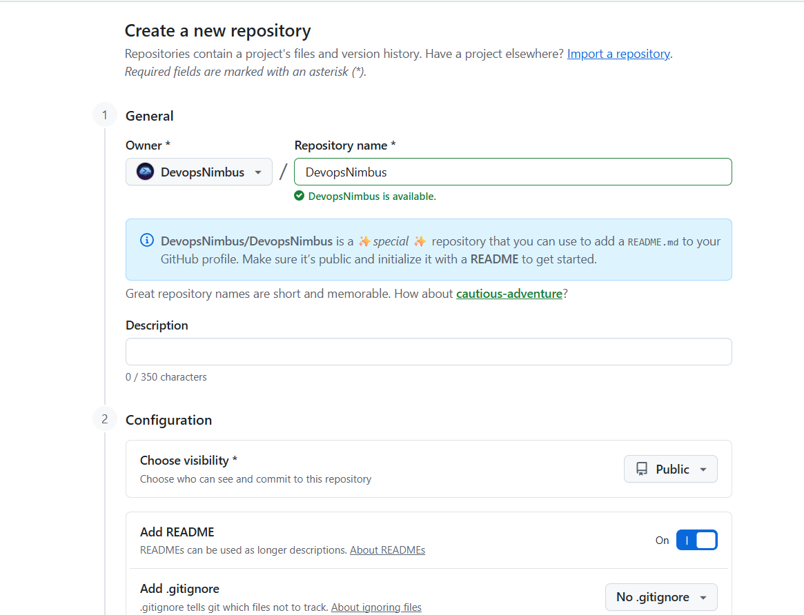

---

## Part 2: Create a token

The website needs permission to commit the README, the images and the daily-update workflows to your profile repository. A fine-grained token limited to that one repository is the safest way to give it.

### Step 2. Open Settings

Click your avatar (top right) and choose **Settings**.

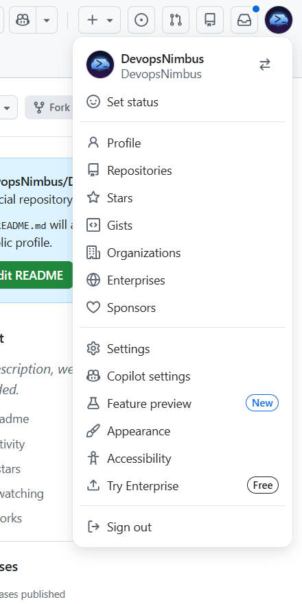

### Step 3. Open Developer settings

Scroll to the bottom of the left menu and click **Developer settings**.

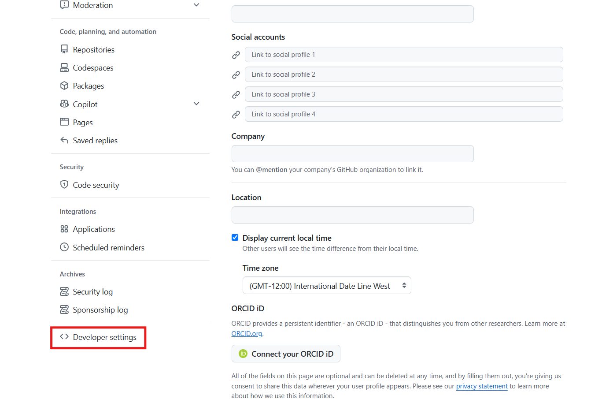

### Step 4. Fine-grained tokens

Open **Personal access tokens → Fine-grained tokens** and click **Generate new token**.

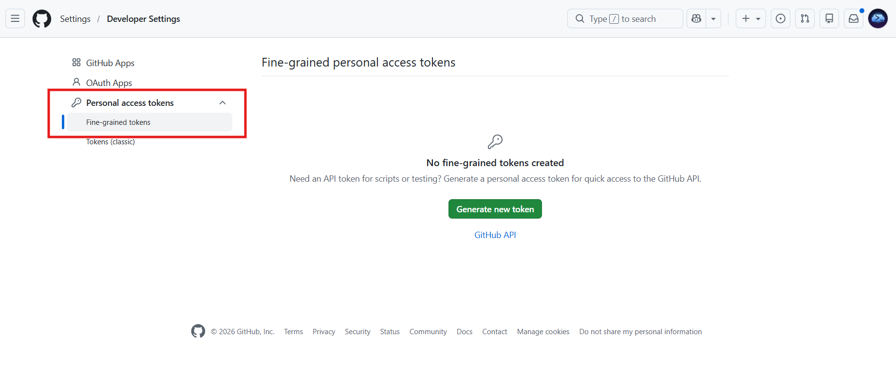

### Step 5. Name it and pick an expiry

Give the token a name you'll recognise (for example `profile-readme`), keep **Resource owner** as your own account, and choose an expiry. You only need the token when you publish from the website; the daily updates use GitHub's own temporary token, so an expired token doesn't stop them.

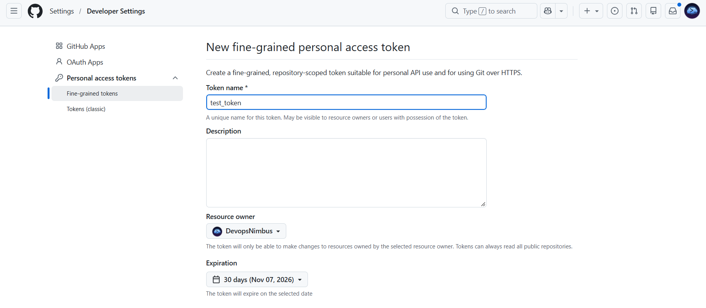

### Step 6. Only your profile repository

Under **Repository access**, choose **Only select repositories** and tick **your-username/your-username**.

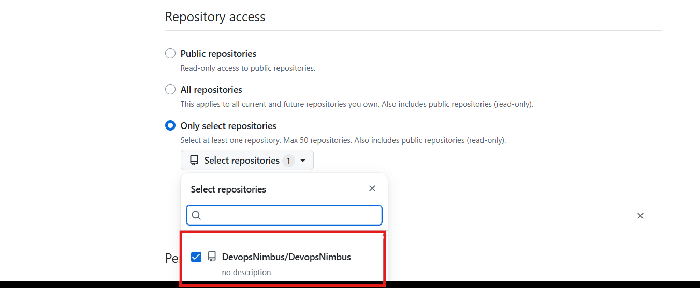

### Step 7. Contents and Workflows: Read and write

Under **Permissions**, click **Add permissions** and set:

| Permission | Access | Why |
| --- | --- | --- |
| **Contents** | Read and write | Commit the README, banner and cards |
| **Workflows** | Read and write | Add the daily-update workflows in `.github/workflows/` |
| Metadata | Read-only | Added by GitHub automatically |

Nothing else is needed. Then click **Generate token**.

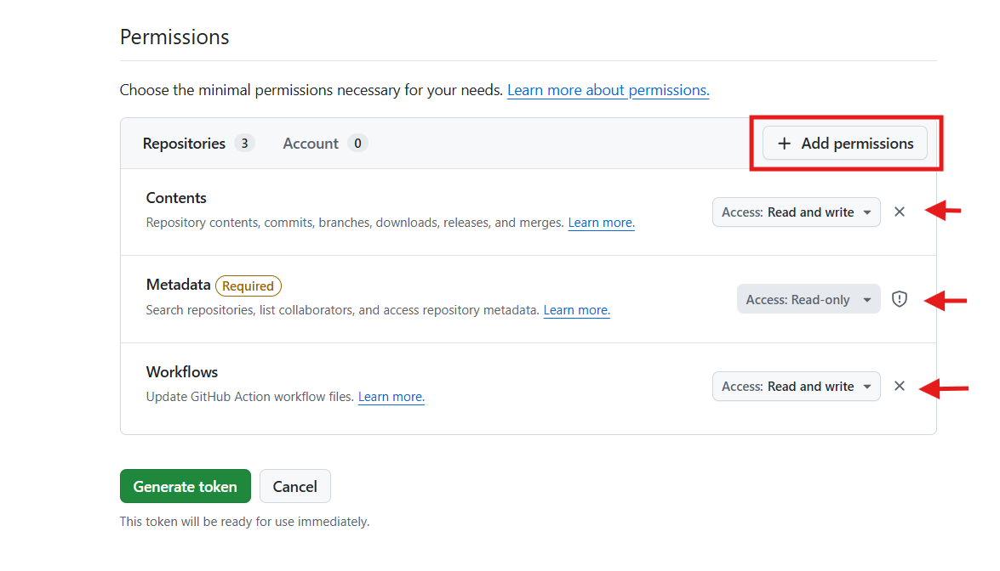

> Without **Workflows: Read and write**, your README and cards are still published, but the daily updates are left out and the website tells you exactly what to add. You can edit the token's permissions later; you don't need a new one.

### Step 8. Copy the token

Copy the token now: GitHub shows it only once. Keep it private and don't paste it anywhere except the website.

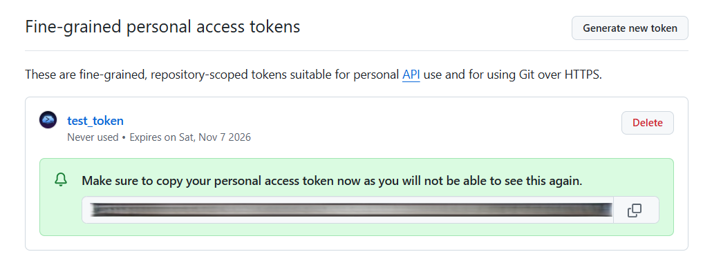

---

## Part 3: Make your README

### Step 9. Open the website

Go to [readme-glassfolio.in](https://readme-glassfolio.in/). You'll see a sample profile straight away; it's replaced by yours in the next step.

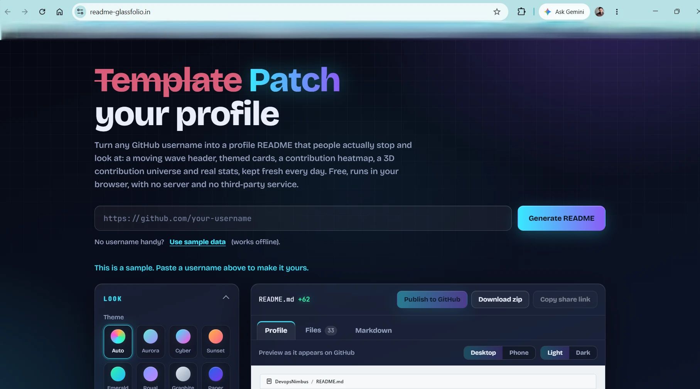

### Step 10. Enter your GitHub link and generate

Paste your profile link (for example `https://github.com/your-username`) or just your username, and click **Generate README**.

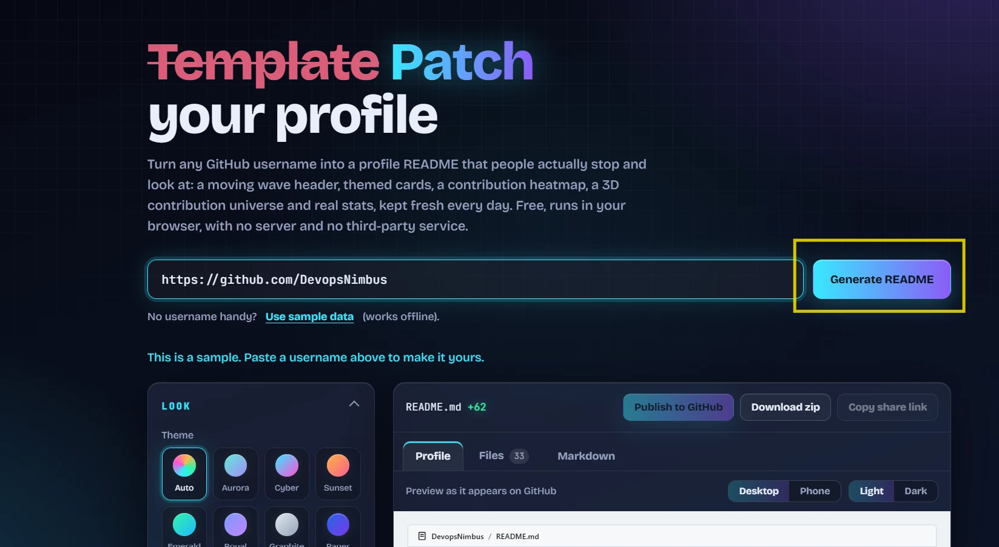

### Step 11 (optional). Exact data

Open **Exact data: add a token** and paste the same token, then click **Generate README** again. With a token the heatmap and streaks cover the **past year** instead of the last 90 days of public activity. The same token is then also used for publishing, so you only paste it once.

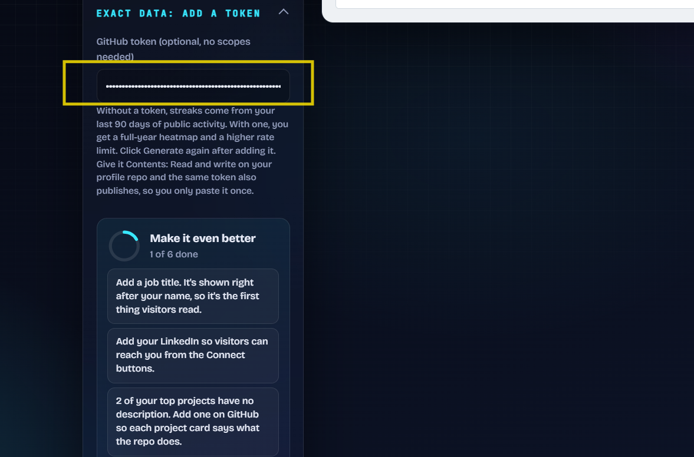

### Step 12. About you

Fill in what you'd like visitors to read first:

- **Job title**: shown right after your name.
- **Tagline**: a smaller line under it.
- **Skills and tools**: comma separated; the first ones also appear in the header.
- **LinkedIn**: adds a LinkedIn button to Connect.

Pick a **Theme** (or *Custom* with your own two colours). The preview on the right updates as you type, and the **Light / Dark** switch shows both versions.

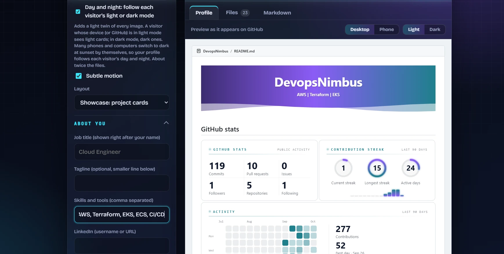

### Step 13. Featured projects and daily updates

Choose which repositories appear as project cards, in the order you tick them (or keep your most-starred ones). Leave **Keep my stats fresh every day** ticked: it adds the workflows that refresh your profile automatically.

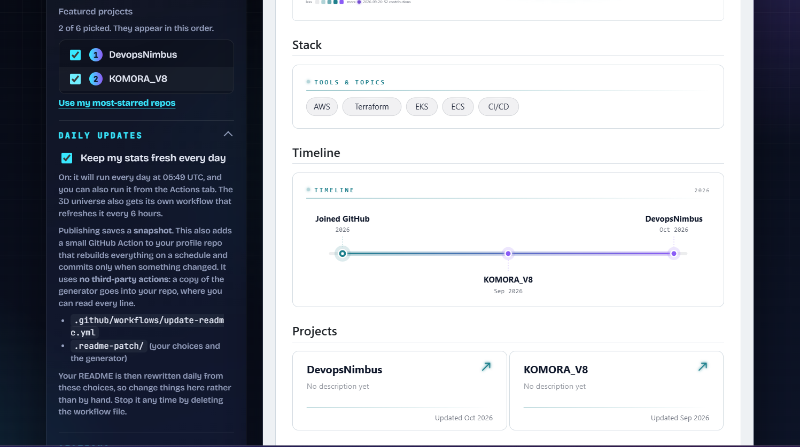

### Step 14. Sections

Tick or untick any section.

On by default:

- **Wave header and footer**: the moving gradient header and footer (untick for the orbit banner and a plain footer).
- **Visual cards**: stats, streak and projects as cards (untick for a text-only README).
- **Contribution heatmap**, **Timeline**, **Projects**, **Connect links**.
- **3D contribution universe**: your contributions as a 3D terrain with your repos orbiting it.
- **Footer credit link**.

Off by default, tick to add:

- **Recently pushed**: your latest pushed repositories.
- **Language donut chart**: repos by language, inside the Languages card.

The **Make it even better** box lists quick wins (a job title, a LinkedIn link, repository descriptions); click a tip to jump to the field that fixes it.

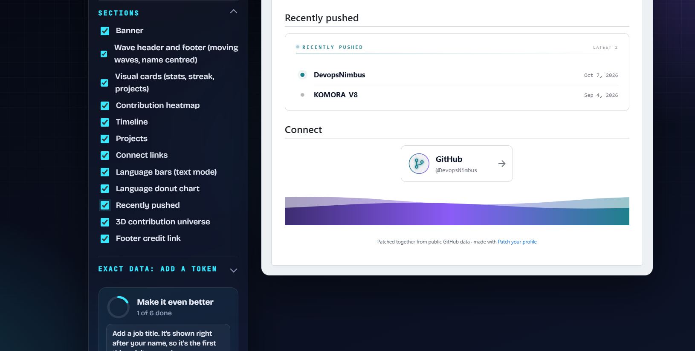

---

## Part 4: Publish

### Step 15. Open the Publish panel

Click **Publish to GitHub**. The panel says which repository it will commit to and which permissions the token needs.

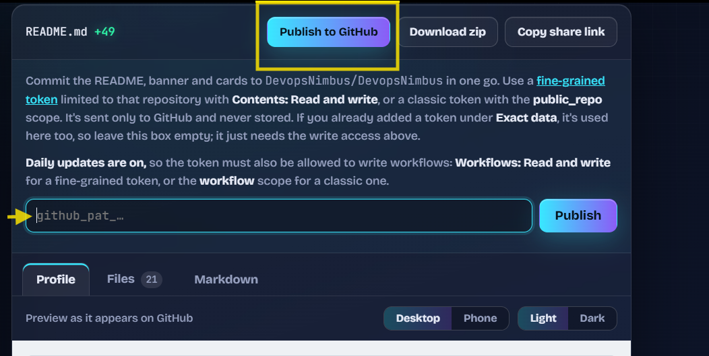

### Step 16. Paste the token and publish

Paste your token and click **Publish**. If you already added it under *Exact data* (step 11), you can leave this box empty.

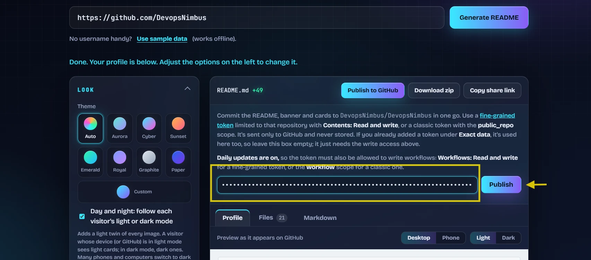

### Step 17. Done

You'll see **Published N files** and the time of your first daily run, with links to your profile and to the Actions tab.

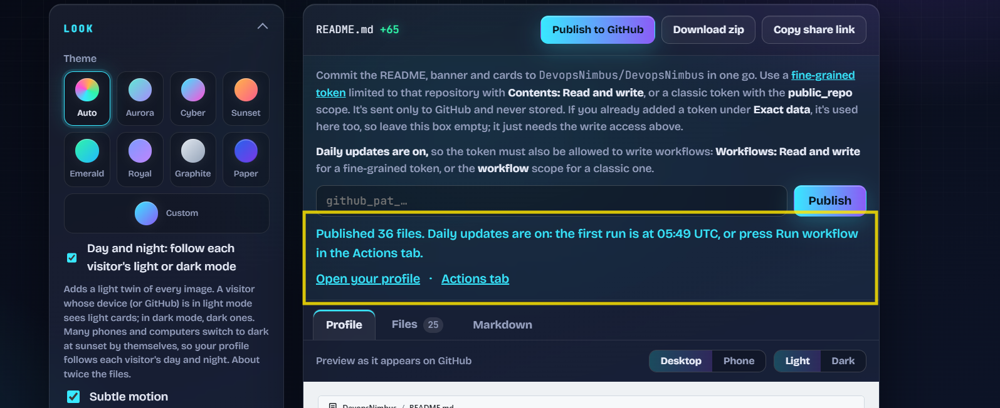

> If it says **Daily updates were NOT added**, the token is missing *Workflows: Read and write* (step 7). Your README is live anyway; fix the token and publish again to add the daily updates.

---

## Part 5: Check your profile

### Step 18. Your profile repository

Your repository now contains:

- `README.md`, `banner.svg`, `banner-light.svg` and a `cards/` folder: the profile and its images, in a dark and a light version.
- `.github/workflows/update-readme.yml`: rebuilds everything **once a day**.
- `.github/workflows/update-universe.yml`: refreshes the 3D universe **every 6 hours**.
- `.readme-patch/`: your saved choices (`config.json`) and the generator the workflows run.

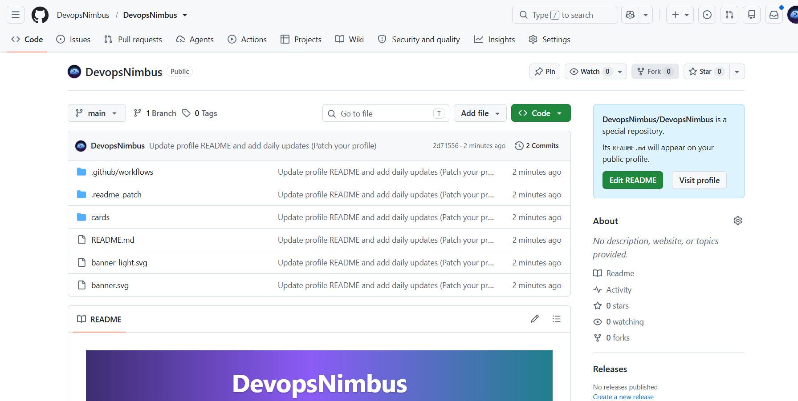

### Steps 19 and 20. Your profile

Open your profile (or the repository's README). Visitors on GitHub's light theme see the light version and visitors on the dark theme see the dark one.

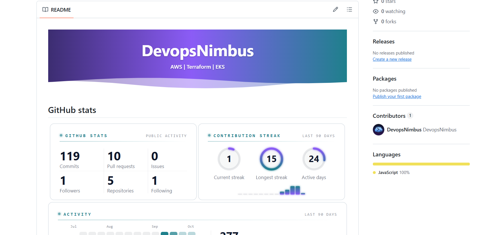

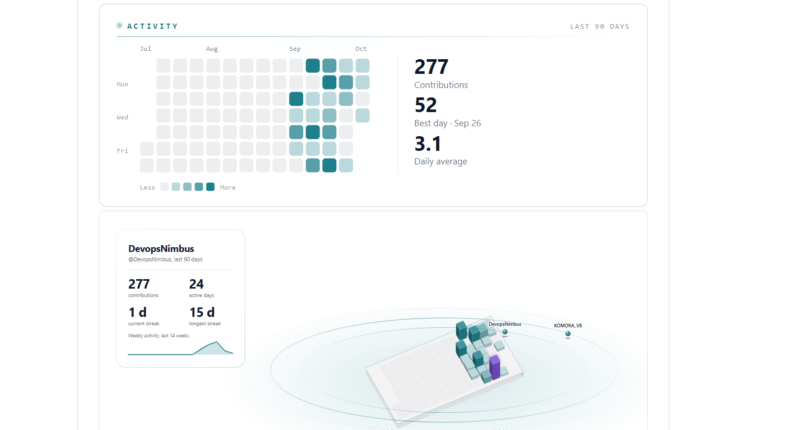

### Run the daily update now (optional)

Open your repository's **Actions** tab, choose **Update profile README** and click **Run workflow** to see it work without waiting for the scheduled time. A successful run makes an **Update profile stats** commit when your numbers have changed.

---

## Change something later

Open the website again, generate with your username, change the options and publish again. The daily workflows always use your latest choices. Don't edit `README.md` or the images by hand: the next daily run rebuilds them from your choices.

## Troubleshooting

| What you see | What to do |
| --- | --- |
| **Daily updates were NOT added** | Give the token **Workflows: Read and write** (step 7) and publish again. The message names what's missing for your token. |
| **The token can't write to this repository** | The token needs **Contents: Read and write** on `your-username/your-username`, and the repository must be in its *Repository access* list (step 6). |
| **Create a public repository named …** | Create the profile repository first (step 1). It must be public and named exactly like your username. |
| **GitHub's rate limit is used up** | Wait a little, or add your token under *Exact data* (step 11). |
| **The website looks like an older version** | Press **Ctrl+Shift+R** (Cmd+Shift+R on a Mac). The page also reloads itself when a newer version has been deployed. |
| **The profile still shows old images** | GitHub caches images for a few minutes. Wait, then refresh the profile. |
| **The daily workflow stopped** | GitHub pauses scheduled workflows in a public repository after 60 days without activity. Re-enable it in the Actions tab. |

To stop the daily updates, delete the two files in `.github/workflows/` or disable them in the Actions tab. Your README stays as it is.
